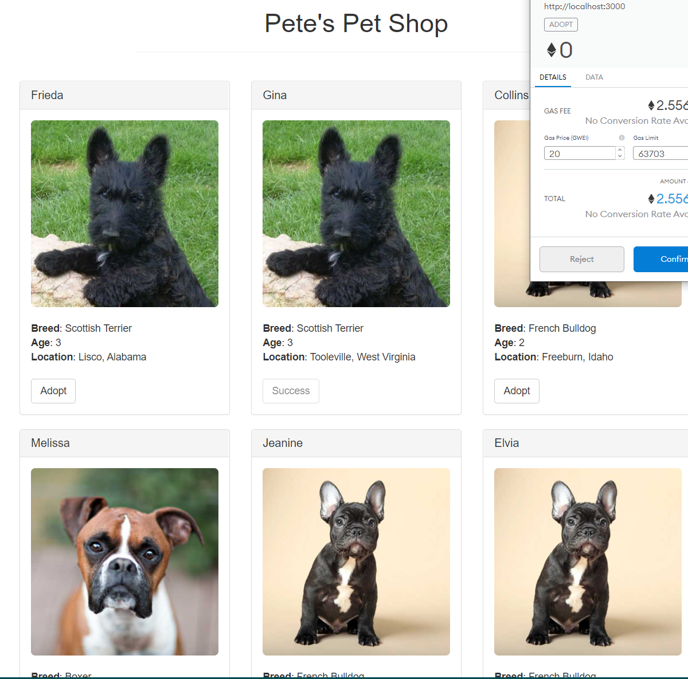

# Pet Adoption Dapp (Decentralized application) 
### Truffle suite and web3 on the ethereum blockchain
### Contents
* Setting up the development environment
* Creating a Truffle project using a Truffle Box
* Writing the smart contract
* Compiling and migrating the smart contract
* Testing the smart contract
* Creating a user interface to interact with the smart contract
* Interacting with the dapp in a browser

### Installation
* Install truffle:
##### `npm install -g truffle`

### Compilation
Solidity is a compiled language, meaning we need to compile our Solidity to bytecode for the Ethereum Virtual Machine (EVM) to execute. Think of it as translating our human-readable Solidity into something the EVM understands.

* To compile the contract:
##### `truffle compile`

### Migration
Migrate contract to the blockchain. A migration is a deployment script meant to alter the state of your application's contracts, moving it from one state to the next.
* Migrate contract to blockchain:
##### `truffle migrate`

### Run dapp on Local web server:
##### `npm run dev`

### Preview

##### Source: https://www.trufflesuite.com/tutorial#your-second-function-retrieving-the-adopters
